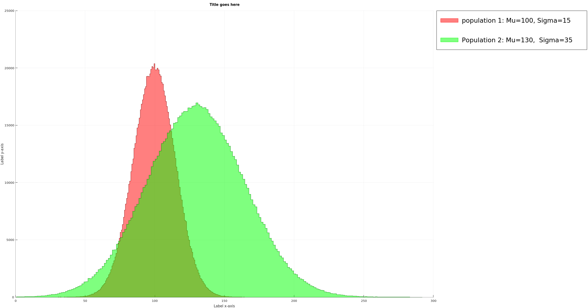

# Histogram Plotter
#### 2018-11-26
Plot two probability distribution as defined by matrix A and B in a unified graph

## Preface
When I tried to use Excel to combine histograms of two different probablility distribution in one graph, I realised that that it wasn't as straight forward as I had hoped. So I dusted off some octave magic to do the job.

## Instructions
- Clone repo
- Enter parameters of distribution A and B (gaussian by default)

  ``` normrnd(Mu, Sigma, rank, [samble_size]) ```

- Run script


